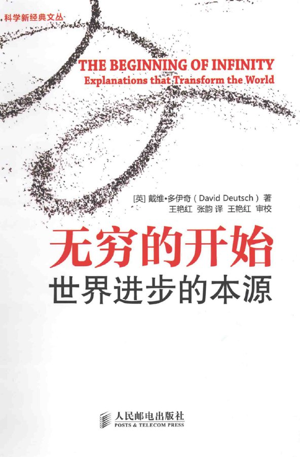

# 介绍

对平时用过的书签和笔记做一下记录，以备查看。

本站已运行：
    

<!-- (考虑到`学习`模块属于文档类，故迁移到`notion`中.) -->

<!-- 现在主要使用 Notion，故这里只做基本维护。（2021.3.30） -->

## 一言 古诗词

    <img
    src="https://v1.jinrishici.com/all.svg?font-size=20&spacing=4"

## 视觉

## 阅读

《无穷的开始》是一次大胆的、包罗万象的智力探险。戴维·多伊奇探索那些使我们理解现实世界怎样运转的重大问题。《真实世界的脉络》描述了我们当前知识中最深刻的4条支线——进化、量子物理学、知识和运算，以及它们带来的世界观。《无穷的开始》将这种世界观应用于许多不同的话题和未解问题，涉及到自由意志、创造力与自然规律、人类的未来与起源、现实与表象、解释与无穷。

多伊奇秉持坚定的理性和乐观态度，对人类选择、科学解释和文化进化的性质得出了惊人的新结论。他的立场并非来自充满希望的格言，而来自关于现实世界怎样运转的事实。他的核心结论是，“解释”在宇宙中有着基础性的地位。解释的范围和造成改变的能力是无穷无尽的。它们唯一的创造者——诸如人类这样能够思考的生物——是宇宙万物中最重要的实体。一切事物都在理性的延伸范围内，不仅是科学和数学，还有道德哲学、政治哲学和美学。在通用物理规律允许的情况下，进步没有限制。

## 目录

- [♾️ AI](/ai.md)
- 📁 一览
  - [w](/一览/w.md)  
  - [x](/一览/x.md)
- 📁 信息
  - [新闻](/信息/新闻.md)
  - [社区](/信息/community.md)
- 📁 资料
  - [学术](/zy/xs.md)
  - [书籍](/zy/books.md)
  - [音乐](/zy/音乐.md)
  - [视频](/zy/视频.md)
  - [图片](/zy/图片.md)
  - [分享](/zy/share.md)
- 📁 工具
  - [搜索](/tools/s&d.md)
  - [利刃](tools/利刃.md)
  - [辅助](/tools/辅助.md)
  - [软件](/tools/软件.md)
  - [导航](tools/导航.md)
- 📁 车库
  - [仓库](/车库/仓库.md)
